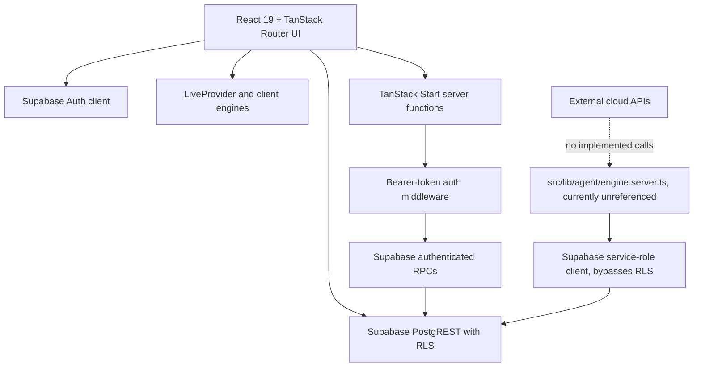

# CloudPulse AI / CloudOps AI
## Current-State Product Requirements Document

**Audit basis:** repository source, configuration, migrations, generated database types, and Supabase security tests present in this workspace on 2026-09-17.

## 1. Product Title

CloudPulse AI / CloudOps AI.

## 2. Product Overview

CloudOps AI is an authenticated operations-console prototype for viewing demo infrastructure resources, synthetic live telemetry, explainable statistical workload forecasts, rule-based anomaly detections, scaling recommendations, simulated scaling actions, INR cost estimates, alerts, and audit/history views.

The current UI uses Supabase for identity, resource/policy/event reads, and protected mutations. The active live dashboard generates telemetry in the browser and keeps the current metric window in React state. A separate server-side agent engine exists and can persist metrics, predictions, alerts, decisions, cost snapshots, and simulated executions, but no route, server function, cron, or scheduler in the inspected source invokes `runAgentCycle`.

## 3. Problem Statement

The project addresses the demonstration need to observe infrastructure-like signals, understand workload risk, test scaling policies, and review operator actions in one console. It does not currently connect to a real cloud provider or collect production telemetry.

## 4. Product Objectives

Current objectives evidenced by the implementation:

- Authenticate users with Supabase Auth.
- Present organization-scoped environments and resources.
- Show synthetic CPU, memory, disk, network, requests, latency, errors, and connections.
- Calculate explainable forecasts and scaling decisions.
- Demonstrate scenario injection and simulated capacity changes.
- Estimate resource costs and right-sizing savings in INR.
- Store and display scaling events, alerts, and audit records where the active path writes them.

## 5. Target Users

- **Viewer:** authenticated user who can inspect organization data and console output.
- **Operator:** authenticated user who can perform operational writes such as scaling, policy changes, monitoring changes, and alert actions.
- **Admin:** authenticated user with operator permissions plus admin-only destructive/database capabilities enforced by RLS.

These are application roles, not external cloud IAM roles.

## 6. User Roles

| Role | Implemented permissions | Assignment and enforcement |
|---|---|---|
| viewer | Read organization data; UI disables write controls | `user_roles.role`; RLS read policies |
| operator | Viewer permissions plus scaling, policy, resource-monitoring, and alert operations | `user_roles.role`; `can_manage_current_organization()` and RPC checks |
| admin | Operator permissions plus admin-only deletes and cloud settings/connections writes | `user_roles.role`; `is_admin()` / `can_admin_current_organization()` and RLS |

New-account role assignment is migration-defined and inconsistent across migration history: later migration logic uses the first user as admin and later users as viewer attached to the first organization, while the tenant-ownership migration defines per-user organizations. The effective result depends on the applied migration sequence and should be verified in the deployed database.

## 7. Product Scope

### In scope today

Authenticated console routes, organization-scoped Supabase data, demo resource inventory, synthetic live UI stream, forecasts, anomaly rules, policy-bounded simulated scaling, scenario controls, cost calculations, alert triage, audit/history display, profile editing, and a visual Three.js AI-agent page.

### Out of scope today

Real AWS/Azure/GCP/Kubernetes execution, real provider telemetry, credential exchange, provider connection testing, external notifications, ML model inference, and a scheduled production collector.

## 8. Current Features

| Feature | Route | Classification | Actual behavior |
|---|---|---|---|
| Landing page | `/` | REAL UI | Static product description and links to auth. |
| Sign in/sign up | `/auth` | REAL | Calls Supabase password auth and account creation. |
| Protected console | `/_authenticated/*` | REAL | `beforeLoad` checks Supabase user; layout provides auth/live contexts. |
| Overview | `/overview` | PARTIAL | Displays live in-memory metrics, forecasts, anomalies, costs, and resource summaries. |
| Infrastructure | `/infrastructure` | PARTIAL | Reads database resources/environments/policies and invokes protected monitoring toggle RPC. |
| Live Metrics | `/metrics` | SIMULATED/PARTIAL | Browser-generated three-second metric stream; CSV export is local. |
| Insights | `/insights` | SIMULATED/PARTIAL | Pure TypeScript moving-average/slope forecast and threshold anomaly rules. |
| Auto-Scaling | `/scaling` | PARTIAL | Policy controls and manual scaling call a protected database RPC; provider effect is simulated. |
| Simulation | `/simulation` | SIMULATED | Browser scenario state modifies synthetic readings. It does not persist the selected scenario from this UI. |
| Cost | `/cost` | SIMULATED/PARTIAL | Local INR arithmetic from resource rates and in-memory average CPU; server snapshot code exists separately. |
| Alerts | `/alerts` | PARTIAL | Reads/updates alerts and creates anomaly alerts from browser-computed anomalies. |
| History | `/history` | REAL/PARTIAL | Reads persisted scaling events and audit logs and exports scaling history. |
| Settings | `/settings` | PARTIAL | Updates profile, reads notifications, and controls session-local pause/autoscaling state. |
| AI Agent | `/ai-agent` | VISUAL-ONLY/PARTIAL | Renders an animated Three.js core; no data or agent-engine call is made by the page. |
| Cloud/SaaS connections | none | MISSING | Tables and provider boundary exist; no connection wizard, credential workflow, verification, or collector exists. |

## 9. Detailed Functional Requirements

### Authentication and navigation

- **FR-001:** The application shall expose `/auth` with sign-in and sign-up tabs using email/password Supabase Auth calls.
- **FR-002:** The application shall redirect authenticated users from `/auth` to `/overview`.
- **FR-003:** The authenticated route layout shall expose the routes listed in Section 8 and sign-out navigation.
- **FR-004:** Authenticated route loading shall require a Supabase user through `supabase.auth.getUser()`.

### Inventory and monitoring

- **FR-005:** The console shall load environments, resources, scaling policies, recent scaling events, and recent metrics from Supabase for the authenticated organization.
- **FR-006:** The Infrastructure page shall display provider, region, type, instances, bounds, rates, health, and current synthetic readings.
- **FR-007:** Operators/admins shall be able to enable or disable resource monitoring through `set_resource_enabled`.
- **FR-008:** The Metrics page shall display CPU, memory, disk, traffic, connections, latency, errors, and network charts and allow local CSV export.

### Analysis and simulation

- **FR-009:** The client analysis engine shall calculate moving averages, linear request trend, confidence, risk, predicted load, and recommended instances.
- **FR-010:** The anomaly engine shall evaluate rolling metric windows for CPU, memory, request growth/drop, latency, errors, and instance changes.
- **FR-011:** The Simulation page shall support `normal`, `traffic_spike`, `memory_leak`, `latency_storm`, and `outage` scenarios, targeted to one resource or the selected environment.
- **FR-012:** The UI shall show the reasoning and numeric inputs behind forecast and scaling decisions.

### Scaling and audit

- **FR-013:** Operators/admins shall be able to change scaling policy bounds, targets, cooldowns, and enabled state through `update_scaling_policy`.
- **FR-014:** Operators/admins shall be able to request manual scale-up, scale-down, or recommendation application through `apply_scaling`.
- **FR-015:** Scaling requests shall be checked for organization ownership, role, bounds, valid trigger, non-empty reason, and changed capacity in the database RPC.
- **FR-016:** Accepted scaling requests shall update `resources.instance_count`, write `scaling_events`, and write an audit record with status `simulated` for the RPC path.
- **FR-017:** The Alerts page shall allow operators/admins to acknowledge and resolve alerts and write corresponding audit rows.
- **FR-018:** The History page shall display persisted scaling events and audit rows and export scaling history as CSV.

### Cost and notifications

- **FR-019:** The Cost page shall calculate hourly, daily, and 30-day monthly estimates from `hourly_rate` and instance count.
- **FR-020:** The Cost page shall calculate an optimized instance count using average CPU and the resource target CPU.
- **FR-021:** Settings shall allow the authenticated user to update their display name and read their notification rows.

## 10. User Workflows

### Authentication workflow

1. User opens `/auth`.
2. Sign in calls `supabase.auth.signInWithPassword`; sign up calls `supabase.auth.signUp` with name metadata.
3. `AuthProvider` loads the profile and roles.
4. The protected route checks `getUser()` and mounts `Shell` and `LiveProvider`.

### Monitoring workflow

1. `LiveProvider.load` reads environments, resources, policies, scaling events, and up to 1,000 metrics.
2. If no metric history exists, it seeds each resource locally.
3. Every three seconds while unpaused, the browser appends a synthetic point and keeps at most 120 points per resource.
4. The UI derives status, forecast, anomalies, and a scaling decision from that state.
5. The active browser loop does not insert each generated metric into `metrics`.

### Simulation workflow

1. User chooses a scenario and optional target resource.
2. `runScenario` changes React state and resumes the stream.
3. `nextPoint` applies deterministic scenario modifiers for up to approximately 40 ticks.
4. The local engines recalculate status, anomalies, forecasts, and decisions.
5. The active UI does not update `simulation_state`; the server agent reads that table if separately invoked.

### Alert workflow

1. `/alerts` reads persisted alerts.
2. For writable users, browser-computed anomalies without matching open alerts are inserted into `alerts` with the profile organization ID.
3. Operators/admins update alert status to acknowledged or resolved.
4. The page inserts an audit record for the action.

### Scaling workflow

1. The client computes a recommendation using current synthetic metrics and policy.
2. Manual actions or browser autonomous mode call the authenticated TanStack server function.
3. The server function validates the request and calls the Supabase `apply_scaling` RPC.
4. The RPC updates the resource and records a `simulated` scaling event and audit row. No cloud API is called.

### AI-agent workflow

The `/ai-agent` page only mounts `AiCore`. Three.js animation responds to pointer movement and reduced-motion preference. It does not call `useLive`, `runAgentCycle`, an AI service, or a cloud provider.

### Application connection workflow

No user workflow exists. `cloud_connections` is a schema table and `AwsProvider` is an inert interface stub; there is no route or form that creates, tests, stores, or consumes provider credentials.

## 11. System Architecture

- **Frontend:** React 19, TypeScript, TanStack Start/Router, Tailwind CSS, Radix UI/shadcn-style components, Recharts.
- **Client logic:** `AuthProvider`, `LiveProvider`, anomaly/prediction/scaling/cost pure modules.
- **Server/API:** TanStack Start server functions for three mutations; generated server agent module is not wired to a request or scheduler.
- **Database:** Supabase PostgreSQL with RLS, RPCs, triggers, realtime publication entries, and generated TypeScript types.
- **External integrations:** Supabase only. AWS is an inert provider stub; no cloud SDK is installed.
- **Background processing:** no verified scheduler or deployed background job. `runAgentCycle` exists but has no caller in inspected source.

## 12. Technology Stack

- React 19.2, TypeScript 5.8, Vite 8, TanStack Start/Router, TanStack Query.
- Tailwind CSS 4 and Radix UI packages with `lucide-react`.
- Recharts for charts.
- Three.js, `@react-three/fiber`, `@react-three/drei`, and postprocessing for the AI visual.
- Supabase JS 2.112, Supabase Auth, PostgreSQL, RLS, and SQL functions.
- Zod validation for server-function inputs.
- ESLint, Prettier, TypeScript, Supabase CLI dependency.
- Nitro/TanStack Start build configuration with a Cloudflare default supplied by the Lovable Vite configuration.
- No AWS, Azure, GCP, Kubernetes, Prometheus, OpenTelemetry, OpenAI, or Anthropic SDK is present in `package.json`.

## 13. Database Architecture

All tables below are declared by the migration history. Current application usage means a source reference was found; schema-only means no route/client usage was found.

| Table | Purpose and important fields | Relationships / RLS | Current use |
|---|---|---|---|
| `organizations` | Tenant id, name, created_at | Parent of profiles/environments/connections/settings; own-org read | Used by auth/profile and RLS |
| `profiles` | user_id, name, email, organization_id | Belongs to organization; same-org/own update policies | Used by auth/settings |
| `user_roles` | user_id, enum role | Read scoped to same org; role writes not exposed | Used by auth |
| `environments` | organization_id, name, description, status | Same-org read/manage for operator/admin | Used by LiveProvider/settings |
| `resources` | environment_id, type, provider, region, enabled, instances, bounds, targets, rate | Same-org read/manage; bounds trigger | Used throughout console |
| `metrics` | resource_id and CPU/memory/disk/network/requests/latency/errors/connections | Same-org read; backend-only writes after later revoke | Read by LiveProvider; server engine writes if invoked |
| `predictions` | resource_id, horizon, load, confidence, risk, recommendation, reasoning | Same-org read; backend-only insert after later revoke | No active route reads persisted predictions |
| `scaling_policies` | resource_id, bounds, targets, cooldowns, enabled | Same-org read/manage | Used by scaling UI and engines |
| `scaling_events` | resource_id, action, previous/new instances, trigger, status, execution_key | Same-org read/manage; unique execution key | Used by scaling/history |
| `alerts` | resource_id, severity, title, status, ack/resolve fields, organization_id added later | Same-org owned rows; operator/admin manage | Used by alerts |
| `notifications` | user_id, title, message, type, read | Own-user rows only | Read by settings; no active producer found |
| `audit_logs` | organization_id added later, actor/action/target/details/status | Same-org reads and own inserts; service-role writes | Used by alerts/settings/RPC/server agent |
| `cost_records` | resource_id, hourly/daily/monthly snapshots | Same-org read; later backend-only writes | Server engine only; cost page recalculates locally |
| `cloud_settings` | organization_id, mode (`demo`/`real`) | Same-org read; admin manage | Server engine reads; no settings UI usage found |
| `cloud_connections` | provider, account_ref, auth_method, credential_ref, scopes, status, errors | Same-org read; admin manage | No route or service usage found |
| `agent_state` | global lock, tick, running, error, autonomous, cost_tick | Authenticated read, service-role write | Server engine only |
| `simulation_state` | global scenario, target resource, started tick | Authenticated read, service-role write | Server engine only |
| `scaling_decisions` | action, bounds, risk, execution key, executed | Read scoped by resource | Server engine only |

The migration sequence also adds realtime publication entries for metrics, alerts, scaling events, resources, and notifications, but the active client code uses query polling/reloads rather than verified Supabase realtime subscriptions.

## 14. Authentication & Authorization

Supabase Auth stores the session. The browser client uses the publishable key and persisted session storage. The TanStack server middleware requires a Bearer token, validates its JWT shape, and calls `supabase.auth.getClaims`. Protected mutations then use the authenticated Supabase client and database RPCs.

Authorization is duplicated in UI affordances (`canWrite`, `isAdmin`) and database RLS/RPC checks. Database enforcement is the authoritative boundary for the implemented mutation RPCs. The server agent uses `supabaseAdmin`, which intentionally bypasses RLS and must remain server-only.

## 15. AI Agent

The `/ai-agent` route provides a visual representation only. `AiCore.tsx` uses React Three Fiber, Three.js geometries, particles, wireframes, lights, bloom, pointer tracking, and reduced-motion handling. The page displays `AGENT ONLINE`, but does not establish an agent connection or report backend cycle state.

A separate `runAgentCycle` implementation performs collect, persist, predict, detect, decide, execute, and periodic cost snapshot steps under a global database lock. Its telemetry is generated by `telemetry.server.ts`, its provider is simulated by default, and no inspected caller schedules or invokes it. No actual AI/ML model or AI service is present.

## 16. Monitoring & Telemetry

Current active monitoring is synthetic. `LiveProvider` uses `window.setInterval` at `TICK_MS = 3000`; `seedPoint` and `nextPoint` generate values using random noise, waves, and scenario modifiers. Browser-generated points are held in `seriesMap` and are not automatically persisted.

The server telemetry module can persist generated points to `metrics`, but only through `runAgentCycle`, which is currently unwired. No provider API, host agent, Prometheus reader, or background collector is present.

## 17. Prediction & Anomaly Detection

Prediction is deterministic statistical logic, not machine learning. `predictWorkload` uses moving averages, least-squares slope, volatility, sample count, capacity, CPU/memory/latency/error pressure, and configured bounds. It returns predicted load, confidence, risk, trend, reason, and recommended instances.

Anomaly detection is deterministic threshold/rate-of-change logic over a maximum 12-point window. It identifies CPU increases, memory pressure, traffic changes, latency degradation, error-rate increases, and instance failures. It produces explainable descriptions and recommended actions.

## 18. Scaling

The active client computes decisions locally using `decideScaling`, which applies enabled state, target CPU/memory, prediction risk, min/max bounds, and cooldowns. The manual mutation path is real database-backed application behavior: `apply_scaling` validates ownership and permissions, updates the local resource row, and inserts a `scaling_events` row. The migration explicitly labels this event `simulated`.

No external cloud capacity is changed. `AwsProvider.scale` always refuses execution with a not-configured message. Azure, GCP, and Kubernetes have no provider implementation.

## 19. Cost Intelligence

`costForResource` computes hourly, daily, and 30-day monthly cost from `hourly_rate` and instance count, then estimates optimized instances from average CPU and the target CPU. Recommendations classify resources as optimized, over-provisioned, idle, or under-provisioned. Values are demonstration estimates in INR, not provider billing data.

The server agent includes `calculateCostSnapshot` and can write `cost_records`, but the active Cost route uses client computation and does not read that table.

## 20. Alerts & Audit

Alerts are persisted in Supabase and can be acknowledged/resolved by writable roles. Active browser anomaly detections can create alert rows. Audit records are written for alert actions, profile updates, scaling RPCs, and server-agent operations where that path runs. History reads the latest 100 scaling events and audit records.

No email, SMS, webhook, push, or external incident-management notification integration is implemented. `notifications` is a database table and read view only in the inspected UI.

## 21. Cloud/SaaS Connectivity

No connection wizard, provider credential handler, connection tester, normalized telemetry adapter, or monitoring ingestion path exists. `cloud_connections` stores metadata fields including `credential_ref`, but no source code consumes them. `providerForMode` supports a simulated provider and an inert AWS stub only. Provider names in types and database constraints do not constitute implemented integrations.

## 22. Simulation Mode

Simulation is the primary current data source for the visible live dashboard. It supports steady state, traffic spike, memory leak, latency storm, and instance outage. Scenario changes are session-local in the active UI. The schema also provides `simulation_state` for the unwired server agent, so persistence and cross-session control are not currently connected to the simulation controls.

## 23. Non-Functional Requirements

- **NFR-001:** The UI shall use typed TypeScript domain models and strict compiler settings.
- **NFR-002:** Protected server mutations shall validate request payloads with Zod and authenticate the request middleware.
- **NFR-003:** Scaling policy and resource capacity bounds shall be enforced by database triggers/RPC validation.
- **NFR-004:** The console shall provide responsive desktop/mobile layouts and reduced-motion handling for the 3D visual.
- **NFR-005:** User-facing failures shall be surfaced through error state, toast, or the server error wrapper where implemented.
- **NFR-006:** CSV exports shall be generated locally from currently loaded data.

## 24. Security Requirements

- **SEC-001:** Supabase service-role credentials shall remain server-only; `client.server.ts` documents and enforces that boundary by file convention.
- **SEC-002:** Authenticated server functions shall require a validated Bearer token through `requireSupabaseAuth`.
- **SEC-003:** Tenant reads and writes shall be constrained by organization-aware RLS policies.
- **SEC-004:** Scaling, policy, and monitoring mutations shall enforce operator/admin authorization in database functions.
- **SEC-005:** Scaling capacity shall remain within policy min/max bounds and database resource triggers.
- **SEC-006:** Metrics, predictions, and cost inserts shall be backend-only after the later migration revokes authenticated insert/update access.
- **SEC-007:** Cloud credentials shall not be copied into client-visible documentation or source; the current connection table contains only references and no working credential flow.

Verified concerns and risks: generated `src/integrations/supabase/types.ts` does not reflect all later migration columns/functions; the server agent’s service-role path bypasses RLS and has no visible caller boundary beyond `.server.ts` naming; role bootstrap behavior changes across migrations; `cloud_connections` is schema-authorized for admin writes without an implemented credential vault or verification service; and browser synthetic analysis can create persisted alerts from non-production data.

## 25. Current Limitations

- **LIM-001:** Visible telemetry is simulated in the browser and is not a real cloud collector.
- **LIM-002:** No AWS/Azure/GCP/Kubernetes/Prometheus integration calls exist.
- **LIM-003:** Scaling changes this application’s database state only; they do not scale cloud infrastructure.
- **LIM-004:** Prediction is deterministic statistical calculation, not ML inference.
- **LIM-005:** The visible simulation is session-local and does not persist `simulation_state`.
- **LIM-006:** `runAgentCycle` is implemented but no inspected route, server function, or scheduler invokes it.
- **LIM-007:** The AI Agent page is visual-only and its online label is not backed by cycle health.
- **LIM-008:** Notifications have no active producer and no read/notification-preference mutation in the UI.
- **LIM-009:** The Cost page derives estimates locally and does not consume persisted `cost_records`.
- **LIM-010:** There are no repository test files outside the Supabase SQL security test discovered in the supplied tree.

## 26. Future Enhancements

These are future scope, not current claims: wire a scheduler to `runAgentCycle`; implement provider adapters and credential storage; connect persisted simulation controls; add real telemetry ingestion and normalized metrics; use a validated ML service if required; add notification producers and delivery channels; reconcile generated database types; and add route/unit/integration tests.

## 27. Risks

- Synthetic values may be mistaken for production telemetry.
- Database-backed simulated scaling can be mistaken for cloud execution.
- Unwired server-agent code can diverge from the active browser path.
- Migration-order differences can produce inconsistent new-user organization/role behavior.
- Service-role execution can bypass tenant RLS if a future caller exposes it incorrectly.
- Stale generated types can conceal schema/API mismatches at compile time.
- Persisting alerts from client-generated anomalies can create misleading operational records.

## 28. Testing Requirements

- Preserve and run `supabase/tests/phase1_security.sql`, which declares 17 pgTAP assertions covering tenant reads, cross-organization access, viewer restrictions, bounds, scaling events, audit records, policy updates, and monitoring updates.
- Add unit tests for prediction, anomaly, scaling, cost, and telemetry engines.
- Add integration tests for server-function authentication, Zod validation, RPC errors, and organization isolation.
- Add a test proving no cloud provider is called in demo mode and real mode fails closed without a verified adapter.
- Add browser tests for authentication, scenario controls, alert lifecycle, manual scaling, and CSV export.
- Add tests for the server-agent scheduler/caller once one exists.

## 29. Deployment

The project is configured as a Vite/TanStack Start application with a custom `src/server.ts` entry and Nitro's Vercel preset in `vite.config.ts`. The production build generates Vercel output in `.vercel/output`; no separate `vercel.json` is required. `package-lock.json` is the deployment lockfile. Runtime requires Supabase URL and publishable key for the browser, the server-side publishable key for authentication, and the service-role key for server-only agent/admin operations. The service-role key must remain server-only. No verified production scheduler is present in the inspected project.

## 30. Current Project Status

**Status: demonstration prototype / partial full-stack implementation.**

The authenticated console, Supabase data model, protected operational RPCs, simulated UI telemetry, explainable statistical analysis, scenario simulation, cost display, alert triage, audit/history views, and visual AI-agent experience are present. Real cloud connectivity, production telemetry, actual autoscaling, ML inference, notification delivery, and scheduled execution are not present. The server-agent implementation is substantial but currently disconnected from the visible application execution path.

### Implementation evidence summary

- Routes: `src/routes/index.tsx`, `auth.tsx`, `routes/_authenticated/*.tsx`
- Auth: `src/hooks/use-auth.tsx`, `src/integrations/supabase/client.ts`, `auth-middleware.ts`
- Active state and synthetic stream: `src/lib/live-store.tsx`
- Analysis: `src/lib/prediction-engine.ts`, `anomaly-detection.ts`, `scaling-engine.ts`, `cost-engine.ts`
- Server mutations: `src/lib/cloudops-functions.ts`, `src/lib/server/cloudops.ts`
- Server agent: `src/lib/agent/engine.server.ts`, `telemetry.server.ts`, `cloud-provider.server.ts`
- AI visual: `src/routes/_authenticated/ai-agent.tsx`, `src/components/ai-agent/AiCore.tsx`
- Database/RLS/RPCs: `supabase/migrations/*.sql`
- Security test: `supabase/tests/phase1_security.sql`
